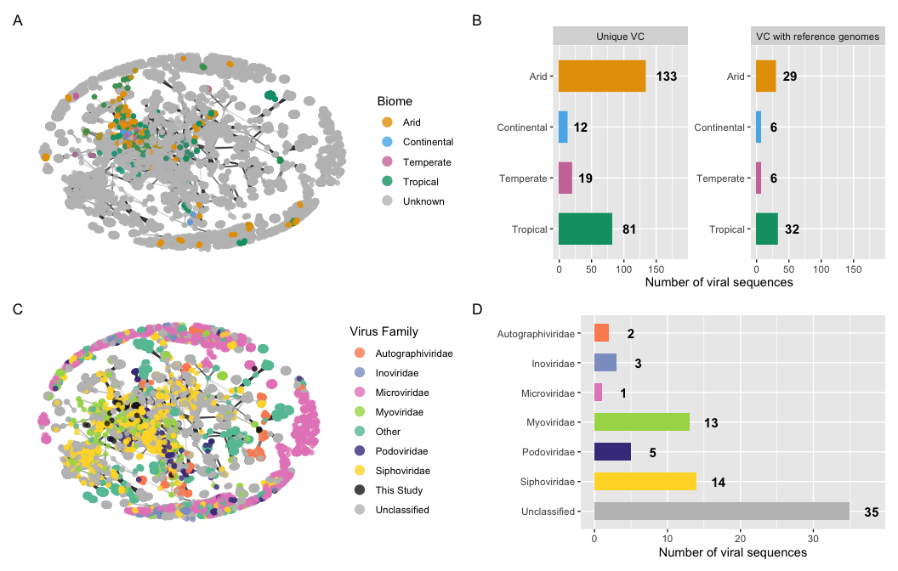
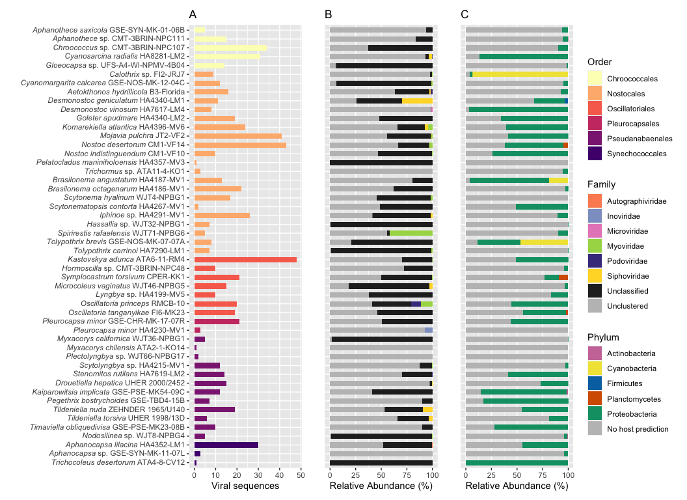

R Analysis of Cyanobacterial Co-culture Metagenome Viral Communities
================
Cassie Ettinger

# Load Libraries

``` r
library(GGally)
library(tidyverse)
library(network)
library(vroom)
library(phyloseq)
library(microbiome)
library(vegan)
library(patchwork)
library(ggnewscale)
library(ggforce)
library(ggtext)
```

# vOTU processing

Following some of Christian Santos Medellin’s scripts:
<https://github.com/cmsantosm/SpatioTemporalViromes/blob/master/Processing/Scripts/votu_filtering.Rmd>

``` r
# get file names
dir <- "data/coverage/"
cov.files <- list.files(path = dir, pattern = "*.tsv", full.names = T)
# cov.files

sampleid <- list.files(path = dir, pattern = "*.tsv", full.names = F) %>%
    str_remove("_mapped_coverge.tsv")  #whoops! mispelled coverage
# sampleid

# open coverage files
cov.list <- lapply(cov.files, read.table, sep = "\t", header = F,
    col.names = c("contig", "start", "end", "coverage"))
names(cov.list) <- sampleid


# Christian's function to get coverage for each vOTUs in
# each bed file and filter out instances in which coverage
# is < 0.75

get_coverage <- function(df) {
    df %>%
        mutate(nbase = end - start) %>%
        group_by(contig) %>%
        mutate(length = sum(nbase)) %>%
        mutate(perc_seq = nbase/length) %>%
        filter(coverage > 0) %>%
        summarise(total_coverage = sum(perc_seq)) %>%
        filter(total_coverage >= 0.75)
}


# Apply the function to all coverage files

cov.list.proc <- lapply(cov.list, get_coverage)
# cov.list.proc


# Make the list into a data frame

cov.df <- plyr::ldply(cov.list.proc, function(x) x) %>%
    rename(SampleID = ".id")

# cov.df


# Convert it to a matrix

cov.mtx <- cov.df %>%
    spread(key = SampleID, value = total_coverage) %>%
    as.data.frame()
row.names(cov.mtx) <- cov.mtx$contig
cov.mtx <- cov.mtx[, -1]

# cov.mtx


# Remove NAs

cov.mtx <- !is.na(cov.mtx)


# Get the tpmean table generated from BAMM and keep only
# those instances where coverage > 0.75

tpmean <- vroom("../output_file_tpmean_121421.tsv")
# tpmean
rownames(tpmean) <- tpmean$`#contig`
tmp <- colnames(tpmean)
tmp <- str_remove(tmp, "_sortedIndexed.bam")
tmp <- str_remove(tmp, "fastq/bbmap/")
colnames(tpmean) <- tmp
tpmean.75 <- tpmean[match(row.names(cov.mtx), row.names(tpmean)),
    match(colnames(cov.mtx), colnames(tpmean))]
tpmean.75 <- cov.mtx * tpmean.75
rownames(tpmean.75) <- row.names(cov.mtx)
tpmean.75.tidy <- tpmean.75 %>%
    as.data.frame() %>%
    mutate(OTU_ID = row.names(.)) %>%
    gather(key = "SampleID", value = "Abundance", -OTU_ID) %>%
    select(SampleID, everything())

# Save formatted tables

# saveRDS(tpmean.75,
# 'results/processed_data/cyanovirome_tpm_75_mtx.RDS')
# saveRDS(tpmean.75.tidy,
# 'results/processed_data/cyanovirome_tpm_75_tidy.RDS')
```

# VContact2 processing

``` r
otu.tidy <- readRDS("results/processed_data/cyanovirome_tpm_75_tidy.RDS")
genome.ov <- read.table("data/vcontact2/genome_by_genome_overview_ictv.csv",
    header = T, sep = ",")
ntwk <- read.table("data/vcontact2/c1_ictv.ntw", header = F,
    sep = " ", col.names = c("OTU1", "OTU2", "Score"))
ictv_names <- vroom("data/vcontact2/INPHARED_1Aug2022_data.tsv")  #Inphared August 2022 data with ICTV names


# source of each vOTU
genome.ov <- genome.ov %>%
    mutate(Source = ifelse(str_detect(Genome, "^TC"), "TC", "refseq"))

genome.ov <- left_join(genome.ov, ictv_names, by = c(Genome = "Accession"))

genome.ov <- genome.ov %>%
    mutate(Order = ifelse(is.na(Order.y), Order.x, Order.y)) %>%
    mutate(Family = ifelse(is.na(Family.y), Family.x, Family.y)) %>%
    mutate(Genus = ifelse(is.na(Genus.y), Genus.x, Genus.y))

# check that # contigs matches number expected (726)
length((genome.ov %>%
    filter(Source == "TC") %>%
    group_by(Genome) %>%
    count())$n)
```

    ## [1] 726

``` r
# Generate a data frame that specifies the composition of
# each cluster in terms of source of network nodes
clstr.source <- genome.ov %>%
    filter(VC.Status == "Clustered") %>%
    filter(VC != "nan") %>%
    mutate(TC = str_detect(Genome, "^TC")) %>%
    group_by(VC, Size) %>%
    summarise(pTC = sum(TC)/n()) %>%
    mutate(ClstrComp = case_when(pTC == 0 ~ "refseq", pTC ==
        1 ~ "TC", TRUE ~ "both"))

# Let's create a data frame with the consensus viral
# taxonomy for each cluster.  5he strategy is to check each
# rank and see if there's only one assignment or a mix.
# Some refeseq entrees have unassigned ranks so I'm
# ignoring those and deciding the proper classification
# based on the rest of the VC members
clstr.phyla <- genome.ov %>%
    filter(VC.Status == "Clustered") %>%
    filter(VC != "nan") %>%
    filter(Phylum != "Unassigned") %>%
    group_by(VC, Phylum) %>%
    count() %>%
    group_by(VC) %>%
    mutate(Duplicates = n()) %>%
    mutate(Phylum = ifelse(Duplicates > 1, "Mixed", as.character(Phylum))) %>%
    group_by(VC, Phylum) %>%
    count() %>%
    select(-n)

clstr.class <- genome.ov %>%
    filter(VC.Status == "Clustered") %>%
    filter(VC != "nan") %>%
    filter(Class != "Unassigned") %>%
    group_by(VC, Class) %>%
    count() %>%
    group_by(VC) %>%
    mutate(Duplicates = n()) %>%
    mutate(Class = ifelse(Duplicates > 1, "Mixed", as.character(Class))) %>%
    group_by(VC, Class) %>%
    count() %>%
    select(-n)

clstr.order <- genome.ov %>%
    filter(VC.Status == "Clustered") %>%
    filter(VC != "nan") %>%
    filter(Order != "Unassigned") %>%
    group_by(VC, Order) %>%
    count() %>%
    group_by(VC) %>%
    mutate(Duplicates = n()) %>%
    mutate(Order = ifelse(Duplicates > 1, "Mixed", as.character(Order))) %>%
    group_by(VC, Order) %>%
    count() %>%
    select(-n)

clstr.family <- genome.ov %>%
    filter(VC.Status == "Clustered") %>%
    filter(VC != "nan") %>%
    filter(Family != "Unassigned") %>%
    group_by(VC, Family) %>%
    count() %>%
    group_by(VC) %>%
    mutate(Duplicates = n()) %>%
    mutate(Family = ifelse(Duplicates > 1, "Mixed", as.character(Family))) %>%
    group_by(VC, Family) %>%
    count() %>%
    select(-n)

clstr.genus <- genome.ov %>%
    filter(VC.Status == "Clustered") %>%
    filter(VC != "nan") %>%
    filter(Genus != "Unassigned") %>%
    group_by(VC, Genus) %>%
    count() %>%
    group_by(VC) %>%
    mutate(Duplicates = n()) %>%
    mutate(Genus = ifelse(Duplicates > 1, "Mixed", as.character(Genus))) %>%
    group_by(VC, Genus) %>%
    count() %>%
    select(-n)


# combine
clstr.master <- clstr.source %>%
    left_join(clstr.phyla, by = "VC") %>%
    left_join(clstr.class, by = "VC") %>%
    left_join(clstr.order, by = "VC") %>%
    left_join(clstr.family, by = "VC") %>%
    left_join(clstr.genus, by = "VC") %>%
    mutate(Phylum = ifelse(is.na(Phylum), "Unassigned", Phylum)) %>%
    mutate(Class = ifelse(is.na(Class), "Unassigned", Class)) %>%
    mutate(Order = ifelse(is.na(Order), "Unassigned", Order)) %>%
    mutate(Family = ifelse(is.na(Family), "Unassigned", Family)) %>%
    mutate(Genus = ifelse(is.na(Genus), "Unassigned", Genus))

# make a taxonomy table for phyloseq
genome.TC <- genome.ov[which(genome.ov$Source == "TC"), ]

genome.TC <- genome.TC[-c(1, 3, 4, 5, 19:58)]

genome.TC.tax <- left_join(genome.TC, clstr.master, by = "VC")

genome.TC.tax <- genome.TC.tax %>%
    mutate(ClusterStatus = ifelse(is.na(Size.x), "Unclustered",
        "Clustered")) %>%
    mutate(VCStatus = ifelse(VC == "", "Unclustered", VC)) %>%
    mutate(Phylum = ifelse(is.na(Phylum), "Unassigned", Phylum)) %>%
    mutate(Class = ifelse(is.na(Class), "Unassigned", Class)) %>%
    mutate(Order = ifelse(is.na(Order), "Unassigned", Order)) %>%
    mutate(Family = ifelse(is.na(Family), "Unassigned", Family)) %>%
    mutate(Genus = ifelse(is.na(Genus), "Unassigned", Genus))

genome.TC.justtax <- genome.TC.tax[-c(2:17)]

# get network information nodes <- ggnet2(ntwk[,-3], mode =
# 'fruchtermanreingold', layout.par =
# list(list=(niter=2000)))$data %>% rename('Genome' =
# 'label') edges <- ntwk %>% mutate(Pair = paste(OTU1,
# OTU2, sep = '.')) %>% gather(key = 'Member', value =
# 'Genome', -Pair, -Score) %>% inner_join(nodes, by =
# 'Genome')

# save files for later saveRDS(nodes,
# 'results/processed_data/ntwk_nodes_ictv.RDS')
# saveRDS(edges,
# 'results/processed_data/ntwk_edges_ictv.RDS')
# saveRDS(genome.ov,
# 'results/processed_data/genome_vc_master_ictv.RDS')
# saveRDS(clstr.master,
# 'results/processed_data/cluster_vc_master_ictv.RDS')
# saveRDS(genome.TC.justtax,
# 'results/processed_data/tax_vc_phyloseq_ictv.RDS')


nodes <- readRDS("results/processed_data/ntwk_nodes_ictv.RDS")
edges <- readRDS("results/processed_data/ntwk_edges_ictv.RDS")


## ICTV names

clstr.phyla.ictv <- genome.ov %>%
    filter(VC.Status == "Clustered") %>%
    filter(VC != "nan") %>%
    filter(ICTV_Phylum != "Unassigned") %>%
    group_by(VC, ICTV_Phylum) %>%
    count() %>%
    group_by(VC) %>%
    mutate(Duplicates = n()) %>%
    mutate(ICTV_Phylum = ifelse(Duplicates > 1, "Mixed", as.character(ICTV_Phylum))) %>%
    group_by(VC, ICTV_Phylum) %>%
    count() %>%
    select(-n)

clstr.class.ictv <- genome.ov %>%
    filter(VC.Status == "Clustered") %>%
    filter(VC != "nan") %>%
    filter(ICTV_Class != "Unassigned") %>%
    group_by(VC, ICTV_Class) %>%
    count() %>%
    group_by(VC) %>%
    mutate(Duplicates = n()) %>%
    mutate(ICTV_Class = ifelse(Duplicates > 1, "Mixed", as.character(ICTV_Class))) %>%
    group_by(VC, ICTV_Class) %>%
    count() %>%
    select(-n)

clstr.order.ictv <- genome.ov %>%
    filter(VC.Status == "Clustered") %>%
    filter(VC != "nan") %>%
    filter(ICTV_Order != "Unassigned") %>%
    group_by(VC, ICTV_Order) %>%
    count() %>%
    group_by(VC) %>%
    mutate(Duplicates = n()) %>%
    mutate(ICTV_Order = ifelse(Duplicates > 1, "Mixed", as.character(ICTV_Order))) %>%
    group_by(VC, ICTV_Order) %>%
    count() %>%
    select(-n)

clstr.family.ictv <- genome.ov %>%
    filter(VC.Status == "Clustered") %>%
    filter(VC != "nan") %>%
    filter(ICTV_Family != "Unassigned") %>%
    group_by(VC, ICTV_Family) %>%
    count() %>%
    group_by(VC) %>%
    mutate(Duplicates = n()) %>%
    mutate(ICTV_Family = ifelse(Duplicates > 1, "Mixed", as.character(ICTV_Family))) %>%
    group_by(VC, ICTV_Family) %>%
    count() %>%
    select(-n)

clstr.genus.ictv <- genome.ov %>%
    filter(VC.Status == "Clustered") %>%
    filter(VC != "nan") %>%
    filter(ICTV_Genus != "Unassigned") %>%
    group_by(VC, ICTV_Genus) %>%
    count() %>%
    group_by(VC) %>%
    mutate(Duplicates = n()) %>%
    mutate(ICTV_Genus = ifelse(Duplicates > 1, "Mixed", as.character(ICTV_Genus))) %>%
    group_by(VC, ICTV_Genus) %>%
    count() %>%
    select(-n)

# combine
clstr.master.ictv <- clstr.source %>%
    left_join(clstr.phyla.ictv, by = "VC") %>%
    left_join(clstr.class.ictv, by = "VC") %>%
    left_join(clstr.order.ictv, by = "VC") %>%
    left_join(clstr.family.ictv, by = "VC") %>%
    left_join(clstr.genus.ictv, by = "VC") %>%
    mutate(ICTV_Order = ifelse(is.na(ICTV_Order), "Unassigned",
        ICTV_Order)) %>%
    mutate(ICTV_Family = ifelse(is.na(ICTV_Family), "Unassigned",
        ICTV_Family)) %>%
    mutate(ICTV_Genus = ifelse(is.na(ICTV_Genus), "Unassigned",
        ICTV_Genus)) %>%
    mutate(ICTV_Phylum = ifelse(is.na(ICTV_Phylum), "Unassigned",
        ICTV_Phylum)) %>%
    mutate(ICTV_Class = ifelse(is.na(ICTV_Class), "Unassigned",
        ICTV_Class))

# make a taxonomy table for phyloseq using the ICTV names
genome.TC <- genome.ov[which(genome.ov$Source == "TC"), ]

genome.TC <- genome.TC[-c(1, 3, 4, 5, 19:58)]

genome.TC.tax.ictv <- left_join(genome.TC, clstr.master.ictv,
    by = "VC")

genome.TC.tax.ictv <- genome.TC.tax.ictv %>%
    mutate(ClusterStatus = ifelse(is.na(Size.x), "Unclustered",
        "Clustered")) %>%
    mutate(VCStatus = ifelse(VC == "", "Unclustered", VC)) %>%
    mutate(ICTV_Phylum = ifelse(is.na(ICTV_Phylum), "Unassigned",
        ICTV_Phylum)) %>%
    mutate(ICTV_Class = ifelse(is.na(ICTV_Class), "Unassigned",
        ICTV_Class)) %>%
    mutate(ICTV_Order = ifelse(is.na(ICTV_Order), "Unassigned",
        ICTV_Order)) %>%
    mutate(ICTV_Family = ifelse(is.na(ICTV_Family), "Unassigned",
        ICTV_Family)) %>%
    mutate(ICTV_Genus = ifelse(is.na(ICTV_Genus), "Unassigned",
        ICTV_Genus))

genome.TC.justtax.ictv <- genome.TC.tax.ictv[-c(2:17)]

# saveRDS(genome.TC.justtax.ictv,
# 'results/processed_data/tax_vc_phyloseq_ictv_conversion.RDS')
```

# Importing vOTU RA into phyloseq and re-naming vOTUS

``` r
# load data
tpmean.75 <- readRDS("results/processed_data/cyanovirome_tpm_75_mtx.RDS")
meta <- read.csv("data/vOTU_meta.csv")
tax <- readRDS("results/processed_data/tax_vc_phyloseq_ictv.RDS")

rownames(meta) <- meta$SampleID

rownames(tpmean.75) <- word(rownames(tpmean.75))
tpmean.75 <- tpmean.75 %>%
    arrange(rownames(tpmean.75))

# remove taxa that don't meet the coverage thresholds
`%!in%` <- Negate(`%in%`)
no.cov.tax <- tax[which(tax$Genome %!in% rownames(tpmean.75)),
    ]
summary(as.factor(no.cov.tax$Phylum))
```

    ## Hofneiviricota     Unassigned    Uroviricota 
    ##              1              9              1

``` r
tax <- tax[which(tax$Genome %in% rownames(tpmean.75)), ]
tax <- tax %>%
    arrange(Genome)

rownames(tax) <- tax$Genome

tax <- as.matrix(tax[-c(1)])

# import into phyloseq
otu_tab = otu_table(tpmean.75, taxa_are_rows = TRUE)
mapping_file = sample_data(meta)
tax_file = tax_table(tax)

# check that all viral otus have coverage (some wont!)
# rownames(tax_file) == rownames(otu_tab)

# rename vOTUs and save conversions
vOTU.names <- as.data.frame(rownames(otu_tab))
vOTU.names$votu.id <- paste0("vOTU", 1:nrow(vOTU.names))

rownames(otu_tab) <- paste0("vOTU", 1:nrow(otu_tab))
rownames(tax_file) <- paste0("vOTU", 1:nrow(tax_file))
```

# CheckV and CD-HIT processing

``` r
# read in quality info
checkv <- read_tsv("data/checkv/quality_summary.tsv")

# Get cluster membership information from cd-hit, to
# connect to vOTUs as multiple genomes can be present in
# some vOTUs due to clustering
cdhit <- read_tsv("data/cdhit/TC_vibrant_checkv_combined_clustered.clsr.info.txt")

checkv_4_cdhit <- checkv %>%
    mutate(Genome = ifelse(contig_id %in% cdhit$id, contig_id,
        paste0(contig_id, "_1")))

checkv_cdhit <- left_join(checkv_4_cdhit, cdhit, by = c(Genome = "id"))

# saveRDS(checkv_cdhit,
# 'results/processed_data/checkv_cdhit_results.RDS')

# subset to get representative seqs for each cluster,
# combine with taxonomy VC and then remove genome ID and
# extra info then combine back based on clstr # to get
# taxonomy for all members of a vOTU

checkv_cdhit_rep <- checkv_cdhit %>%
    filter(clstr_rep == 1)

checkv_cdhit_rep_tax <- left_join(checkv_cdhit_rep, genome.TC.justtax)
checkv_cdhit_rep_tax <- left_join(checkv_cdhit_rep_tax, genome.TC.justtax.ictv)

# vOTU.names

# we need to add in vOTU IDs for those vOTUs that had
# insufficient coverage/counts for inclusion earlier note
# the naming here is semi-manual as need to know how many
# vOTUs prior (that is where 715 came from) could change to
# length of something here instead in future
no.cov.vOTU.names <- tibble(no.cov.tax)
no.cov.vOTU.names$`rownames(otu_tab)` <- no.cov.tax$Genome
no.cov.vOTU.names$votu.id <- paste0("vOTU", 715 + 1:nrow(no.cov.vOTU.names))
no.cov.vOTU.names <- no.cov.vOTU.names[(9:10)]

vOTUs.ids.for.join <- full_join(vOTU.names, no.cov.vOTU.names)

checkv_cdhit_rep_tax_votu <- left_join(checkv_cdhit_rep_tax,
    vOTUs.ids.for.join, by = c(Genome = "rownames(otu_tab)"))

# get clustr # and taxonomy from representative genomes
checkv_cdhit_rep_tax_cltr <- checkv_cdhit_rep_tax_votu[-c(1:15,
    17:21)]

checkv_cdhit_tax <- left_join(checkv_cdhit, checkv_cdhit_rep_tax_cltr)

checkv_cdhit_tax <- checkv_cdhit_tax %>%
    mutate(Sample = str_extract(Genome, "[^_]+"))

# saveRDS(checkv_cdhit_tax,
# 'results/processed_data/checkv_cdhit_results_with_tax_ictv.RDS')
# write_csv(checkv_cdhit_tax,
# 'checkv_cdhit_results_with_tax_ictv.csv')
```

# Host Prediction

``` r
host <- vroom("data/ncbi_host_prediction/bactarch.blastn.tab",
    col_names = c("qseqid", "sseqid", "pident", "bitscore", "evalue",
        "length", "sgi", "sacc", "sallseqid", "staxids", "sscinames",
        "stitle"))

# length of alignment
minlen = 2000
minpercid = 70
minbit = 50
mine = 0.001  #we set evalue at 1e-25 so not an issue here, they all should be lower than this


host.filt <- host[which(host$bitscore >= minbit), ]
host.filt <- host.filt[which(host.filt$length >= minlen), ]
host.filt <- host.filt[which(host.filt$pident >= minpercid),
    ]

# take the dataframe & group it by the grouping variable
# (query genome) and take the top five hits
host.filt.top5 <- host.filt %>%
    group_by(qseqid) %>%
    slice(1:5)


# do some work on the terminal to get the taxonomy for each
# accession cut -f 2 bactarch.blastn.tab > acc.txt cat
# acc.txt | epost -db nuccore | esummary -db nuccore |
# xtract -pattern DocumentSummary -element Caption,TaxId >
# taxa.txt

# cut -f2 taxa.txt | ete3 ncbiquery --info > taxonomy.txt

# import results from NCBI/ete3
tax2name <- vroom("data/ncbi_host_prediction/taxonomy.txt")
acc2tax <- vroom("data/ncbi_host_prediction/taxa.txt", col_names = FALSE)

# fix taxonomy levels as they are not perfect this is
# annoyingly manual
tax2name <- tax2name %>%
    mutate_at("Named Lineage", str_replace, "Bacteroidetes/Chlorobi group,",
        "") %>%
    mutate_at("Named Lineage", str_replace, "Terrabacteria group,",
        "") %>%
    mutate_at("Named Lineage", str_replace, "delta/epsilon subdivisions,",
        "") %>%
    mutate_at("Named Lineage", str_replace, "Cystobacterineae,",
        "") %>%
    mutate_at("Named Lineage", str_replace, "Sorangiineae,",
        "") %>%
    mutate_at("Named Lineage", str_replace, "Roseiflexineae,",
        "") %>%
    mutate_at("Named Lineage", str_replace, "Nannocystineae,",
        "") %>%
    mutate_at("Named Lineage", str_replace, "PVC group,", "") %>%
    mutate_at("Named Lineage", str_replace, "FCB group,", "") %>%
    mutate_at("Named Lineage", str_replace, "Cyanobacteria/Melainabacteria group,",
        "") %>%
    mutate_at("Named Lineage", str_replace, "Klebsiella/Raoultella group,",
        "") %>%
    mutate_at("Named Lineage", str_replace, "Chromobacterium group,",
        "") %>%
    mutate_at("Named Lineage", str_replace, "Erythrobacter/Porphyrobacter group,",
        "") %>%
    mutate_at("Named Lineage", str_replace, "Massilia group,",
        "") %>%
    mutate_at("Named Lineage", str_replace, "Sinorhizobium/Ensifer group,",
        "") %>%
    mutate_at("Named Lineage", str_replace, "Brucella/Ochrobactrum group,",
        "") %>%
    mutate_at("Named Lineage", str_replace, "Rhizobium/Agrobacterium group,",
        "") %>%
    mutate_at("Named Lineage", str_replace, "Azotobacter group,",
        "") %>%
    mutate_at("Named Lineage", str_replace, "Alteromonas/Salinimonas group,",
        "") %>%
    mutate_at("Named Lineage", str_replace, "Chryseobacterium group,",
        "")


# note this is imperfect at 'species' level, seems OK at
# some higher levels, BLAST should also be accurate to
# genus level anyway so should not be an issue for most
# host predictions
tax2name.split <- tax2name %>%
    separate("Named Lineage", into = c("root", "domain", "superkingdom",
        "phylum", "class", "order", "family", "genus", "species"),
        sep = ",")

tax_acc <- left_join(acc2tax, tax2name.split, by = c(X2 = "# Taxid"))

host.filt.top5 <- host.filt.top5 %>%
    mutate_at("sacc", str_replace, "\\d$", "") %>%
    mutate_at("sacc", str_replace, "\\.", "")

host.filt.top5.taxa <- left_join(host.filt.top5, tax_acc, by = c(sacc = "X1"))

# collect how many different taxonomic groups in the top 5
# hits per each viral genome
host.filt.top5.taxa.info <- host.filt.top5.taxa %>%
    summarise(Pd = n_distinct(phylum), Cd = n_distinct(class),
        Od = n_distinct(order), Fd = n_distinct(family), Gd = n_distinct(genus),
        Sd = n_distinct(species))

virus.names <- unique(host.filt.top5.taxa.info$qseqid)
host.gen <- as.data.frame(virus.names)

# take the dataframe & group it by the grouping variable
# (genome) take only the top hit now
host.filt.taxa.top1 <- host.filt.top5.taxa %>%
    group_by(qseqid) %>%
    slice(1)

# if only one taxonomic classification at each level in
# host.filt.top5.taxa.info, then we take the phylum of the
# top hit from host.filt.taxa.top1, otherwise we assign it
# as 'Mixed' meaning that multiple taxonomic groupings were
# matches at that level for that genome host.gen.tax <-
# host.gen %>% mutate(Phylum =
# ifelse(host.filt.top5.taxa.info[qseqid ==
# virus.names,]$Pd == 1, host.filt.taxa.top1[qseqid ==
# virus.names,]$phylum, 'Mixed')) %>% mutate(Class =
# ifelse(host.filt.top5.taxa.info[qseqid ==
# virus.names,]$Cd == 1, host.filt.taxa.top1[qseqid ==
# virus.names,]$class, 'Mixed')) %>% mutate(Order =
# ifelse(host.filt.top5.taxa.info[qseqid ==
# virus.names,]$Od == 1, host.filt.taxa.top1[qseqid ==
# virus.names,]$order, 'Mixed')) %>% mutate(Family =
# ifelse(host.filt.top5.taxa.info[qseqid ==
# virus.names,]$Fd == 1, host.filt.taxa.top1[qseqid ==
# virus.names,]$family, 'Mixed')) %>% mutate(Genus =
# ifelse(host.filt.top5.taxa.info[qseqid ==
# virus.names,]$Gd == 1, host.filt.taxa.top1[qseqid ==
# virus.names,]$genus, 'Mixed'))

# write_csv(host.gen.tax,
# 'results/processed_data/viral.host.taxonomy.csv')
# saveRDS(host.gen.tax,
# 'results/processed_data/host.gen.tax.RDS')

host.gen.tax <- readRDS("results/processed_data/host.gen.tax.RDS")

# contect host info to vOTUs
host.vots <- left_join(host.gen.tax, vOTU.names, by = c(virus.names = "rownames(otu_tab)"))

host.vots <- host.vots[-c(1)]

checkv_cdhit_tax.host <- left_join(checkv_cdhit_tax, host.vots,
    by = c(votu.id = "votu.id"))

# write_csv(checkv_cdhit_tax.host,
# 'results/processed_data/checkv_cdhit_tax.host_ictv.csv')
```

# vOTU analyses

``` r
# load in hosts too as a 2nd phyloseq object
vir <- as.tibble(rownames(tpmean.75))
vir$vOTU <- paste0("vOTU", 1:nrow(otu_tab))
vir.host <- left_join(vir, host.gen.tax, by = c(value = "virus.names"))
vir.host.tax <- vir.host
vir.host.tax <- vir.host.tax[-c(1, 2)]

vir.host.tax <- vir.host.tax %>%
    mutate(Phylum = fct_explicit_na(Phylum, na_level = "No host prediction"),
        Class = fct_explicit_na(Class, na_level = "No host prediction"),
        Order = fct_explicit_na(Order, na_level = "No host prediction"),
        Family = fct_explicit_na(Family, na_level = "No host prediction"),
        Genus = fct_explicit_na(Genus, na_level = "No host prediction"))

# Change 'Mixed' to 'No host prediction'
vir.host.tax <- vir.host.tax %>%
    mutate(Phylum = ifelse(Phylum == "Mixed", "No host prediction",
        as.character(Phylum)))


vir.host.tax.mtx <- as.matrix(vir.host.tax)
rownames(vir.host.tax.mtx) <- vir.host$vOTU

vir.tax.file <- tax_table(vir.host.tax.mtx)

# import vOTU and host data into phyloseq
ps <- phyloseq(otu_tab, tax_file, mapping_file)
ps.host <- phyloseq(otu_tab, vir.tax.file, mapping_file)

## Get relative abundance averages for plotting ##

# For visualization - show only genomes with a quality
# score from CheckV

votus.high <- unique(na.omit(checkv_cdhit_tax$votu.id[checkv_cdhit_tax$checkv_quality %in%
    c("High-quality", "Complete", "Medium-quality", "Low-quality")]))

ps.HQ <- prune_taxa(votus.high, ps)

ps.RA <- transform_sample_counts(ps.HQ, function(x) x/sum(x))

df_ps.RA.melt <- psmelt(ps.RA)

grouped <- group_by(df_ps.RA.melt, TaxID, Phylum, Class, Order,
    Family, VCStatus, ClusterStatus, Genus, OTU)

avgs_grouped <- summarise(grouped, mean = 100 * mean(Abundance))

vOTU_avgs_grouped <- avgs_grouped


# HOST

ps.host.HQ <- prune_taxa(votus.high, ps.host)

ps.RA <- transform_sample_counts(ps.host.HQ, function(x) x/sum(x))

df_ps.host.RA.melt <- psmelt(ps.RA)

grouped.host <- group_by(df_ps.host.RA.melt, TaxID, Phylum, Class,
    Order, Family, Genus, OTU)

avgs_grouped.host <- summarise(grouped.host, mean = 100 * mean(Abundance))

hostpred_avgs_grouped <- avgs_grouped.host
```

# Networks

``` r
# these take a while to load the images

clstrd.nodes <- nodes %>%
    left_join(genome.ov, by = "Genome") %>%
    filter(VC.Status == "Clustered")

# we will again only visualize genomes with a quality score

# plot by fam
vir.fam.clust.hq <- genome.ov %>%
    filter(Source == "TC") %>%
    select(Genome, VC, VC.Status) %>%
    inner_join(clstr.master, by = "VC") %>%
    filter(ClstrComp == "both") %>%
    filter(Order != "Unassigned") %>%
    left_join(select(checkv_cdhit_tax, Genome, checkv_quality),
        by = "Genome") %>%
    filter(!checkv_quality %in% c("Not-determined")) %>%
    group_by(Order, Family) %>%
    count() %>%
    group_by(Order) %>%
    mutate(nOrd = sum(n)) %>%
    arrange(nOrd, n) %>%
    ungroup() %>%
    mutate(Rank = 1:n())

vir.fam.nodes.hq <- clstrd.nodes %>%
    left_join(select(clstr.master, VC, ClstrComp), by = "VC") %>%
    left_join(select(checkv_cdhit_tax, Genome, checkv_quality),
        by = "Genome") %>%
    filter(!checkv_quality %in% c("Not-determined")) %>%
    mutate(Family2 = case_when(Source == "TC" ~ "This Study",
        Family %in% vir.fam.clust.hq$Family ~ as.character(Family),
        TRUE ~ "Other")) %>%
    left_join(vir.fam.clust.hq, by = c(Family2 = "Family")) %>%
    filter(Source == "refseq" | ClstrComp == "both")

# Plot
ntwk.vir.hq <- vir.fam.nodes.hq %>%
    ggplot(aes(x, y)) + geom_line(data = filter(edges, Genome %in%
    vir.fam.nodes.hq$Genome), aes(group = Pair), alpha = 0.1,
    color = "gray25", size = 0.5) + geom_point(alpha = 0.8, size = 2,
    shape = 16, aes(color = Family2)) + scale_color_manual(name = "Virus Family",
    values = c(RColorBrewer::brewer.pal(8, "Set2")[c(2:5)], RColorBrewer::brewer.pal(8,
        "Set2")[c(1)], "slateblue4", RColorBrewer::brewer.pal(8,
        "Set2")[c(6)], "gray10", "gray75")) + theme_minimal() +
    theme(axis.text = element_blank(), axis.title = element_blank(),
        panel.grid = element_blank(), legend.position = "right") +
    guides(color = guide_legend(override.aes = list(shape = 16,
        size = 4)))
```

    ## Warning: Using `size` aesthetic for lines was deprecated in ggplot2 3.4.0.
    ## ℹ Please use `linewidth` instead.
    ## This warning is displayed once every 8 hours.
    ## Call `lifecycle::last_lifecycle_warnings()` to see where this warning was
    ## generated.

``` r
# ntwk.vir.hq


# plot by habitat
checkv_cdhit_tax.meta <- left_join(checkv_cdhit_tax, meta, by = c(Sample = "sample"))

vir.hab.nodes.hq <- clstrd.nodes %>%
    left_join(select(clstr.master, VC, ClstrComp), by = "VC") %>%
    left_join(select(checkv_cdhit_tax.meta, Genome, checkv_quality, Koeppen.Broad), by = c("Genome")) %>%
    filter(!checkv_quality %in% c("Not-determined")) %>%
    mutate(Habitat_Group = ifelse(is.na(Koeppen.Broad), "Unknown",
        as.character(Koeppen.Broad)))  #%>%
# filter(Source == 'refseq' | ClstrComp == 'both')

vir.hab.nodes.hq <- vir.hab.nodes.hq[-c(66)]


# Plot
ntwk.hab.vir.hq <- vir.hab.nodes.hq %>%
    ggplot(aes(x, y)) + geom_line(data = filter(edges, Genome %in%
    vir.hab.nodes.hq$Genome), aes(group = Pair), alpha = 0.1,
    color = "gray25", size = 0.5) + geom_point(alpha = 0.8, size = 2,
    shape = 16, aes(color = Koeppen.Broad)) + scale_color_manual(name = "Habitat",
    values = c("#E69F00", "#56B4E9", "#009E73", "#CC79A7", "gray75")) + theme_minimal() +
    theme(axis.text = element_blank(), axis.title = element_blank(),
        panel.grid = element_blank(), legend.position = "right") +
    guides(color = guide_legend(override.aes = list(shape = 16,
        size = 4)))


# ntwk.hab.vir.hq
```

# Generating Plots / Tables

# Figure 1

``` r
# import metadata
meta <- read.csv("../vOTU_meta.csv")

# phage vs. prophage

checkv_cdhit_tax.meta.pro <- checkv_cdhit_tax.meta %>%
    group_by(provirus) %>%
    tally()

checkv_cdhit_tax.meta.pro <- checkv_cdhit_tax.meta.pro %>%
    arrange(desc(provirus)) %>%
    mutate(lab_ypos = n + 0.05 * sum(n))

b_provir <- ggplot(checkv_cdhit_tax.meta.pro, aes(x = provirus,
    fill = provirus, y = n)) + geom_bar(stat = "identity", position = "stack",
    width = 0.6) + scale_fill_manual(values = c("black", "grey75")) +
    ylab("Number of viral sequences") + theme(plot.title = element_text(hjust = 0.5,
    vjust = 0.5, face = "bold"), axis.text.x = element_text(angle = -60,
    hjust = 0, vjust = 0.5)) + xlab("Proviral Status") + theme(legend.position = "none") +
    geom_text(aes(y = lab_ypos, label = n, group = provirus),
        fontface = "bold", size = 4, color = "black")


# quality of sequences

checkv_cdhit_tax.meta.qual <- checkv_cdhit_tax.meta %>%
    group_by(checkv_quality) %>%
    tally() %>%
    arrange(desc(n)) %>%
    mutate(lab_ypos = n + 0.03 * sum(n))


checkv_cdhit_tax.meta.qual$checkv_quality <- factor(checkv_cdhit_tax.meta.qual$checkv_quality,
    levels = c("Complete", "High-quality", "Medium-quality",
        "Low-quality", "Not-determined"))

c_qual <- ggplot(checkv_cdhit_tax.meta.qual, aes(x = checkv_quality,
    fill = checkv_quality, y = n)) + geom_bar(stat = "identity",
    position = "stack", width = 0.6) + scale_fill_viridis_d(option = "D") +
    ylab("Number of viral sequences") + theme(plot.title = element_text(hjust = 0.5,
    vjust = 0.5, face = "bold"), axis.text.x = element_text(angle = -60,
    hjust = 0, vjust = 0.5)) + xlab("CheckV Quality") + theme(legend.position = "none") +
    geom_text(aes(y = lab_ypos, label = n, group = checkv_quality),
        fontface = "bold", size = 4, color = "black")


b_provir + c_qual + plot_annotation(tag_levels = "A")  #+ plot_layout(guides = 'collect')
```

<!-- -->

``` r
ggsave(filename = "plots/cyano_stats.pdf", plot = last_plot(),
    device = "pdf", width = 7, height = 4, dpi = 300)
ggsave(filename = "plots/cyano_stats.png", plot = last_plot(),
    device = "png", width = 7, height = 4, dpi = 300)
```

# Figure 2

``` r
# habitat x VC

meta.sub.seq <- checkv_cdhit_tax.meta %>%
    filter(checkv_quality %in% c("High-quality", "Complete",
        "Medium-quality", "Low-quality")) %>%
    filter(ClusterStatus == "Clustered") %>%
    group_by(Koeppen.Broad, Order) %>%
    mutate(Order = ifelse(Order == "Unassigned", "Unique VC",
        "VC with reference genomes")) %>%
    tally() %>%
    arrange(desc(Koeppen.Broad)) %>%
    mutate(lab_ypos = n + 0.1 * n + 20) %>%
    mutate(norm = n/sum(n) * 100)

a_hab_seq <- ggplot(meta.sub.seq, aes(y = Koeppen.Broad, fill = Koeppen.Broad,
    color = Koeppen.Broad, x = n)) + geom_bar(stat = "identity",
    position = "stack", width = 0.6, orientation = "y") + scale_fill_manual(name = "Habitat",
    values = c("#E69F00", "#56B4E9", "#009E73", "#CC79A7", "gray75")) + scale_color_manual(name = "Habitat",
    values = c("#E69F00", "#56B4E9", "#009E73", "#CC79A7", "gray75")) + ylab("") + facet_wrap(~Order,
    scales = "free") + xlab("Number of viral sequences") + geom_text(aes(x = lab_ypos,
    label = n, group = Koeppen.Broad), fontface = "bold", size = 4,
    color = "black") + scale_y_discrete(limits = rev) + theme(legend.position = "none") +
    xlim(0, 190)


# taxonomy

checkv_cdhit_tax.meta.tax <- checkv_cdhit_tax.meta %>%
    filter(checkv_quality %in% c("High-quality", "Complete",
        "Medium-quality", "Low-quality")) %>%
    filter(ClusterStatus == "Clustered" & Order != "Unassigned") %>%
    mutate(Family = ifelse(Family == "Mixed", "Unclassified",
        as.character(Family))) %>%
    group_by(Family) %>%
    tally() %>%
    arrange(desc(n)) %>%
    group_by(Family) %>%
    mutate(n2 = sum(n)) %>%
    mutate(lab_ypos = n2 + 3)


e_tax <- ggplot(checkv_cdhit_tax.meta.tax, aes(x = Family, fill = Family,
    y = n)) + geom_bar(stat = "identity", position = "stack",
    width = 0.6) + scale_fill_manual(values = c(RColorBrewer::brewer.pal(8,
    "Set2")[c(2:5)], "slateblue4", RColorBrewer::brewer.pal(8,
    "Set2")[c(6)], "grey 75")) + ylab("Number of viral sequences") +
    xlab("") + theme(legend.position = "none") + geom_text(aes(y = lab_ypos,
    label = n2, group = Family), fontface = "bold", size = 4,
    color = "black") + coord_flip() + scale_x_discrete(limits = rev)

# combine with network plots from earlier
(ntwk.hab.vir.hq + a_hab_seq)/(ntwk.vir.hq + e_tax) + plot_annotation(tag_levels = "A")  #+ plot_layout(guides = 'collect') 
```

<!-- -->

``` r
ggsave(filename = "plots/cyano_VC_networks_hq_ictv.pdf", plot = last_plot(),
    device = "pdf", width = 11, height = 7, dpi = 300)
ggsave(filename = "plots/cyano_VC_networks_hq_ictv.png", plot = last_plot(),
    device = "png", width = 11, height = 7, dpi = 300)
```

# Figure 3

``` r
# Figure 3 join relative abundance info from phyloseq with
# our metadata
vOTU_avgs_grouped.meta <- left_join(vOTU_avgs_grouped, meta)
```

    ## Joining with `by = join_by(TaxID)`

``` r
hostpred_avgs_grouped.meta <- left_join(hostpred_avgs_grouped,
    meta)
```

    ## Joining with `by = join_by(TaxID)`

``` r
# plot relative abundance charts

# factor host phylum and taxonomy so that ordered by
# Cyanobacteria

vOTU_avgs_grouped.meta <- vOTU_avgs_grouped.meta %>%
    mutate(Family2 = ifelse(Family %in% c("Unassigned", "Unclassified",
        "Mixed"), ifelse(ClusterStatus == "Clustered", "Unclassified",
        "Unclustered"), as.character(Family)))

hostpred_avgs_grouped.meta$Phylum <- factor(hostpred_avgs_grouped$Phylum,
    levels = c("Actinobacteria", "Bacteroidetes", "Cyanobacteria",
        "Firmicutes", "Planctomycetes", "Proteobacteria", "No host prediction"))

hostpred_avgs_grouped.meta$TaxID <- factor(hostpred_avgs_grouped.meta$TaxID,
    levels = c("Aphanothece saxicola GSE-SYN-MK-01-06B", "Aphanothece sp. CMT-3BRIN-NPC111",
        "Chroococcus sp. CMT-3BRIN-NPC107", "Cyanosarcina radialis HA8281-LM2",
        "Gloeocapsa sp. UFS-A4-WI-NPMV-4B04", "Calothrix sp. FI2-JRJ7",
        "Cyanomargarita calcarea GSE-NOS-MK-12-04C", "Aetokthonos hydrillicola B3-Florida",
        "Desmonostoc geniculatum HA4340-LM1", "Desmonostoc vinosum HA7617-LM4",
        "Goleter apudmare HA4340-LM2", "Komarekiella atlantica HA4396-MV6",
        "Mojavia pulchra JT2-VF2", "Nostoc desertorum CM1-VF14",
        "Nostoc indistinguendum CM1-VF10", "Pelatocladus maniniholoensis HA4357-MV3",
        "Trichormus sp. ATA11-4-KO1", "Brasilonema angustatum HA4187-MV1",
        "Brasilonema octagenarum HA4186-MV1", "Scytonema hyalinum WJT4-NPBG1",
        "Scytonematopsis contorta HA4267-MV1", "Iphinoe sp. HA4291-MV1",
        "Hassallia sp. WJT32-NPBG1", "Spirirestis rafaelensis WJT71-NPBG6",
        "Tolypothrix brevis GSE-NOS-MK-07-07A", "Tolypothrix carrinoi HA7290-LM1",
        "Kastovskya adunca ATA6-11-RM4", "Hormoscilla sp. CMT-3BRIN-NPC48",
        "Symplocastrum torsivum CPER-KK1", "Microcoleus vaginatus WJT46-NPBG5",
        "Lyngbya sp. HA4199-MV5", "Oscillatoria princeps RMCB-10",
        "Oscillatoria tanganyikae FI6-MK23", "Pleurocapsa minor GSE-CHR-MK-17-07R",
        "Pleurocapsa minor HA4230-MV1", "Myxacorys californica WJT36-NPBG1",
        "Myxacorys chilensis ATA2-1-KO14", "Plectolyngbya sp. WJT66-NPBG17",
        "Scytolyngbya sp. HA4215-MV1", "Stenomitos rutilans HA7619-LM2",
        "Drouetiella hepatica UHER 2000/2452", "Kaiparowitsia implicata GSE-PSE-MK54-09C",
        "Pegethrix bostrychoides GSE-TBD4-15B", "Tildeniella nuda ZEHNDER 1965/U140",
        "Tildeniella torsiva UHER 1998/13D", "Timaviella obliquedivisa GSE-PSE-MK23-08B",
        "Nodosilinea sp. WJT8-NPBG4", "Aphanocapsa lilacina HA4352-LM1",
        "Aphanocapsa sp. GSE-SYN-MK-11-07L", "Trichocoleus desertorum ATA4-8-CV12"))

vOTU_avgs_grouped.meta$TaxID <- factor(vOTU_avgs_grouped.meta$TaxID,
    levels = c("Aphanothece saxicola GSE-SYN-MK-01-06B", "Aphanothece sp. CMT-3BRIN-NPC111",
        "Chroococcus sp. CMT-3BRIN-NPC107", "Cyanosarcina radialis HA8281-LM2",
        "Gloeocapsa sp. UFS-A4-WI-NPMV-4B04", "Calothrix sp. FI2-JRJ7",
        "Cyanomargarita calcarea GSE-NOS-MK-12-04C", "Aetokthonos hydrillicola B3-Florida",
        "Desmonostoc geniculatum HA4340-LM1", "Desmonostoc vinosum HA7617-LM4",
        "Goleter apudmare HA4340-LM2", "Komarekiella atlantica HA4396-MV6",
        "Mojavia pulchra JT2-VF2", "Nostoc desertorum CM1-VF14",
        "Nostoc indistinguendum CM1-VF10", "Pelatocladus maniniholoensis HA4357-MV3",
        "Trichormus sp. ATA11-4-KO1", "Brasilonema angustatum HA4187-MV1",
        "Brasilonema octagenarum HA4186-MV1", "Scytonema hyalinum WJT4-NPBG1",
        "Scytonematopsis contorta HA4267-MV1", "Iphinoe sp. HA4291-MV1",
        "Hassallia sp. WJT32-NPBG1", "Spirirestis rafaelensis WJT71-NPBG6",
        "Tolypothrix brevis GSE-NOS-MK-07-07A", "Tolypothrix carrinoi HA7290-LM1",
        "Kastovskya adunca ATA6-11-RM4", "Hormoscilla sp. CMT-3BRIN-NPC48",
        "Symplocastrum torsivum CPER-KK1", "Microcoleus vaginatus WJT46-NPBG5",
        "Lyngbya sp. HA4199-MV5", "Oscillatoria princeps RMCB-10",
        "Oscillatoria tanganyikae FI6-MK23", "Pleurocapsa minor GSE-CHR-MK-17-07R",
        "Pleurocapsa minor HA4230-MV1", "Myxacorys californica WJT36-NPBG1",
        "Myxacorys chilensis ATA2-1-KO14", "Plectolyngbya sp. WJT66-NPBG17",
        "Scytolyngbya sp. HA4215-MV1", "Stenomitos rutilans HA7619-LM2",
        "Drouetiella hepatica UHER 2000/2452", "Kaiparowitsia implicata GSE-PSE-MK54-09C",
        "Pegethrix bostrychoides GSE-TBD4-15B", "Tildeniella nuda ZEHNDER 1965/U140",
        "Tildeniella torsiva UHER 1998/13D", "Timaviella obliquedivisa GSE-PSE-MK23-08B",
        "Nodosilinea sp. WJT8-NPBG4", "Aphanocapsa lilacina HA4352-LM1",
        "Aphanocapsa sp. GSE-SYN-MK-11-07L", "Trichocoleus desertorum ATA4-8-CV12"))


# plot vOTU taxonomy x relative abudance
a <- ggplot(vOTU_avgs_grouped.meta, aes(x = mean, fill = Family2,
    y = TaxID)) + geom_bar(orientation = "y", stat = "identity",
    position = "stack", width = 0.6) + scale_fill_manual(values = c(RColorBrewer::brewer.pal(8,
    "Set2")[c(2:5)], "slateblue4", RColorBrewer::brewer.pal(8,
    "Set2")[c(6)], "grey15", "grey75")) + ggtitle("B") + ylab("") +
    xlab("Relative Abundance (%)") + theme(axis.text.y = element_blank(),
    axis.ticks.y = element_blank()) + ylab("") + scale_y_discrete(limits = rev) +
    guides(fill = guide_legend(title = "Family"))


# host x relative abundance
b <- ggplot(hostpred_avgs_grouped.meta, aes(x = mean, fill = Phylum,
    y = TaxID)) + geom_bar(orientation = "y", stat = "identity",
    position = "stack", width = 0.6) +   scale_fill_manual(values=c("#CC79A7","#F0E442",  
    "#0072B2", "#D55E00", "#009E73", "grey75"))+ + theme(axis.text.y = element_blank(),
    axis.ticks.y = element_blank()) + ylab("") + ggtitle("C") +
    xlab("Relative Abundance (%)") + scale_y_discrete(limits = rev)


# viral seqs per sample
viralseq <- checkv_cdhit_tax.meta %>%
    filter(checkv_quality != "Not-determined") %>%
    group_by(TaxID, order) %>%
    tally()


viralseq$TaxID <- factor(viralseq$TaxID, levels = c("Aphanothece saxicola GSE-SYN-MK-01-06B",
    "Aphanothece sp. CMT-3BRIN-NPC111", "Chroococcus sp. CMT-3BRIN-NPC107",
    "Cyanosarcina radialis HA8281-LM2", "Gloeocapsa sp. UFS-A4-WI-NPMV-4B04",
    "Calothrix sp. FI2-JRJ7", "Cyanomargarita calcarea GSE-NOS-MK-12-04C",
    "Aetokthonos hydrillicola B3-Florida", "Desmonostoc geniculatum HA4340-LM1",
    "Desmonostoc vinosum HA7617-LM4", "Goleter apudmare HA4340-LM2",
    "Komarekiella atlantica HA4396-MV6", "Mojavia pulchra JT2-VF2",
    "Nostoc desertorum CM1-VF14", "Nostoc indistinguendum CM1-VF10",
    "Pelatocladus maniniholoensis HA4357-MV3", "Trichormus sp. ATA11-4-KO1",
    "Brasilonema angustatum HA4187-MV1", "Brasilonema octagenarum HA4186-MV1",
    "Scytonema hyalinum WJT4-NPBG1", "Scytonematopsis contorta HA4267-MV1",
    "Iphinoe sp. HA4291-MV1", "Hassallia sp. WJT32-NPBG1", "Spirirestis rafaelensis WJT71-NPBG6",
    "Tolypothrix brevis GSE-NOS-MK-07-07A", "Tolypothrix carrinoi HA7290-LM1",
    "Kastovskya adunca ATA6-11-RM4", "Hormoscilla sp. CMT-3BRIN-NPC48",
    "Symplocastrum torsivum CPER-KK1", "Microcoleus vaginatus WJT46-NPBG5",
    "Lyngbya sp. HA4199-MV5", "Oscillatoria princeps RMCB-10",
    "Oscillatoria tanganyikae FI6-MK23", "Pleurocapsa minor GSE-CHR-MK-17-07R",
    "Pleurocapsa minor HA4230-MV1", "Myxacorys californica WJT36-NPBG1",
    "Myxacorys chilensis ATA2-1-KO14", "Plectolyngbya sp. WJT66-NPBG17",
    "Scytolyngbya sp. HA4215-MV1", "Stenomitos rutilans HA7619-LM2",
    "Drouetiella hepatica UHER 2000/2452", "Kaiparowitsia implicata GSE-PSE-MK54-09C",
    "Pegethrix bostrychoides GSE-TBD4-15B", "Tildeniella nuda ZEHNDER 1965/U140",
    "Tildeniella torsiva UHER 1998/13D", "Timaviella obliquedivisa GSE-PSE-MK23-08B",
    "Nodosilinea sp. WJT8-NPBG4", "Aphanocapsa lilacina HA4352-LM1",
    "Aphanocapsa sp. GSE-SYN-MK-11-07L", "Trichocoleus desertorum ATA4-8-CV12"),
    labels = c("*Aphanothece saxicola* GSE-SYN-MK-01-06B", "*Aphanothece* sp. CMT-3BRIN-NPC111",
        "*Chroococcus* sp. CMT-3BRIN-NPC107", "*Cyanosarcina radialis* HA8281-LM2",
        "*Gloeocapsa* sp. UFS-A4-WI-NPMV-4B04", "*Calothrix* sp. FI2-JRJ7",
        "*Cyanomargarita calcarea* GSE-NOS-MK-12-04C", "*Aetokthonos hydrillicola* B3-Florida",
        "*Desmonostoc geniculatum* HA4340-LM1", "*Desmonostoc vinosum* HA7617-LM4",
        "*Goleter apudmare* HA4340-LM2", "*Komarekiella atlantica* HA4396-MV6",
        "*Mojavia pulchra* JT2-VF2", "*Nostoc desertorum* CM1-VF14",
        "*Nostoc indistinguendum* CM1-VF10", "*Pelatocladus maniniholoensis* HA4357-MV3",
        "*Trichormus* sp. ATA11-4-KO1", "*Brasilonema angustatum* HA4187-MV1",
        "*Brasilonema octagenarum* HA4186-MV1", "*Scytonema hyalinum* WJT4-NPBG1",
        "*Scytonematopsis contorta* HA4267-MV1", "*Iphinoe* sp. HA4291-MV1",
        "*Hassallia* sp. WJT32-NPBG1", "*Spirirestis rafaelensis* WJT71-NPBG6",
        "*Tolypothrix brevis* GSE-NOS-MK-07-07A", "*Tolypothrix carrinoi* HA7290-LM1",
        "*Kastovskya adunca* ATA6-11-RM4", "*Hormoscilla* sp. CMT-3BRIN-NPC48",
        "*Symplocastrum torsivum* CPER-KK1", "*Microcoleus vaginatus* WJT46-NPBG5",
        "*Lyngbya* sp. HA4199-MV5", "*Oscillatoria princeps* RMCB-10",
        "*Oscillatoria tanganyikae* FI6-MK23", "*Pleurocapsa minor* GSE-CHR-MK-17-07R",
        "*Pleurocapsa minor* HA4230-MV1", "*Myxacorys californica* WJT36-NPBG1",
        "*Myxacorys chilensis* ATA2-1-KO14", "*Plectolyngbya* sp. WJT66-NPBG17",
        "*Scytolyngbya* sp. HA4215-MV1", "*Stenomitos rutilans* HA7619-LM2",
        "*Drouetiella hepatica* UHER 2000/2452", "*Kaiparowitsia implicata* GSE-PSE-MK54-09C",
        "*Pegethrix bostrychoides* GSE-TBD4-15B", "*Tildeniella nuda* ZEHNDER 1965/U140",
        "*Tildeniella torsiva* UHER 1998/13D", "*Timaviella obliquedivisa* GSE-PSE-MK23-08B",
        "*Nodosilinea* sp. WJT8-NPBG4", "*Aphanocapsa lilacina* HA4352-LM1",
        "*Aphanocapsa* sp. GSE-SYN-MK-11-07L", "*Trichocoleus desertorum* ATA4-8-CV12"))


viralseq.plot <- ggplot(viralseq, aes(x = n, y = TaxID, fill = order)) +
    geom_bar(orientation = "y", stat = "identity", position = "stack",
        width = 0.6) + xlab("Viral sequences") + ggtitle("A") +
    ylab("") + scale_fill_viridis_d(option = "A", begin = 0.25,
    direction = -1) + guides(fill = guide_legend(title = "Order")) +
    scale_y_discrete(limits = rev) + theme(axis.text.y = element_markdown())


# combined plot
viralseq.plot + a + b + plot_layout(guides = "collect")
```

<!-- -->

``` r
ggsave(filename = "plots/cyano_tree_plus_v_family_ictv.png",
    plot = last_plot(), device = "png", width = 11, height = 8,
    dpi = 300)
ggsave(filename = "plots/cyano_tree_plus_v_family_ictv.pdf",
    plot = last_plot(), device = "pdf", width = 15, height = 10,
    dpi = 300)
```

# Making some tables and summarzing some counts

``` r
# number of viruses
length(unique(checkv_cdhit_tax.meta$Genome))
```

    ## [1] 814

``` r
# number vOTUs
length(unique(checkv_cdhit_tax$Genome))
```

    ## [1] 814

``` r
# number prophage
summary(as.factor(checkv_cdhit_tax$provirus))
```

    ##  No Yes 
    ## 626 188

``` r
# number high-qual / complete of all viruses
summary(as.factor(checkv_cdhit_tax$checkv_quality))
```

    ##       Complete   High-quality    Low-quality Medium-quality Not-determined 
    ##              7             32            465            208            102

``` r
# number of viruses with quality scores
814 - 102
```

    ## [1] 712

``` r
# average length, range
summary(checkv_cdhit_tax$contig_length)
```

    ##    Min. 1st Qu.  Median    Mean 3rd Qu.    Max. 
    ##    5013   11753   20967   27594   40038  199914

``` r
# genes
summary(checkv_cdhit_tax$gene_count)
```

    ##    Min. 1st Qu.  Median    Mean 3rd Qu.    Max. 
    ##    5.00   13.00   25.00   35.38   53.00  278.00

``` r
# viral genes
summary(checkv_cdhit_tax$viral_genes)
```

    ##    Min. 1st Qu.  Median    Mean 3rd Qu.    Max. 
    ##   0.000   2.000   6.000   8.896  14.000  40.000

``` r
# host genes
summary(checkv_cdhit_tax$host_genes)
```

    ##    Min. 1st Qu.  Median    Mean 3rd Qu.    Max. 
    ##   0.000   0.000   1.000   2.448   4.000  27.000

``` r
# number per sample
summary(summary(as.factor(checkv_cdhit_tax$Sample)))
```

    ##    Min. 1st Qu.  Median    Mean 3rd Qu.    Max. 
    ##    1.00    7.00   13.00   16.28   21.75   54.00

``` r
# unique VCs
length(unique(as.factor(checkv_cdhit_tax$VCStatus[checkv_cdhit_tax$clstr_rep ==
    1]))) - 1
```

    ## [1] 111

``` r
# clustered vOTUs
summary(as.factor(checkv_cdhit_tax$ClusterStatus[checkv_cdhit_tax$clstr_rep ==
    1]))
```

    ##   Clustered Unclustered 
    ##         305         421

``` r
# clustered total sequences
summary(as.factor(checkv_cdhit_tax$ClusterStatus))
```

    ##   Clustered Unclustered 
    ##         341         473

``` r
# number vOTUs dropped due to low coverage
length(no.cov.tax$Genome)
```

    ## [1] 11

``` r
# number VCs dropped due to low coverage
# unique(no.cov.tax$Class)
length(unique(no.cov.tax$VCStatus)) - 1  #for Unclustered
```

    ## [1] 9

``` r
# cluster representation by composition
summary(as.factor(clstr.master$ClstrComp))
```

    ##   both refseq     TC 
    ##     26   1538     79

``` r
# 6 'Clustered/Singleton' TC only clusters dropped too
length(unique(genome.ov$VC[genome.ov$VC.Status != "Clustered" &
    genome.ov$Source == "TC"])) - 1  # empty
```

    ## [1] 6

``` r
# double check these wouldn't be part of cluster with ref
# data genome.ov[genome.ov$VC %in%
# unique(genome.ov$VC[genome.ov$VC.Status != 'Clustered' &
# genome.ov$Source == 'TC'])[1:11],]

# taxonomy by sequences
summary(as.factor(checkv_cdhit_tax$Order))
```

    ##  Caudovirales         Mixed  Petitvirales Tubulavirales    Unassigned 
    ##            32            32             1             3           739 
    ##  Unclassified 
    ##             7

``` r
summary(as.factor(checkv_cdhit_tax$VCStatus[checkv_cdhit_tax$Order !=
    "Unassigned"]))
```

    ##    1_0 1031_0 1109_0  121_0  132_0 1378_0 1431_0 1442_0   18_0  187_0  191_0 
    ##      1      1      1      2      2      3      1      2      2      2      9 
    ##  195_0   25_0  304_0  346_0  362_0  444_0  509_0  714_0  745_0  780_1  783_0 
    ##      1      1      1      2      1      1      2     27      1      1      6 
    ##  828_0  839_0  871_0  934_0 
    ##      2      1      1      1

``` r
sum(summary(as.factor(checkv_cdhit_tax$VCStatus[checkv_cdhit_tax$Order !=
    "Unassigned"])))
```

    ## [1] 75

``` r
checkv_cdhit_tax.ord <- checkv_cdhit_tax %>%
    filter(VCStatus %in% unique(checkv_cdhit_tax$VCStatus[checkv_cdhit_tax$Order !=
        "Unassigned"])) %>%
    group_by(VCStatus, Order, Family, Genus) %>%
    tally()

unique(checkv_cdhit_tax.ord$Order)
```

    ## [1] "Unclassified"  "Caudovirales"  "Mixed"         "Tubulavirales"
    ## [5] "Petitvirales"

``` r
unique(checkv_cdhit_tax.ord$Family)
```

    ## [1] "Unclassified"      "Siphoviridae"      "Mixed"            
    ## [4] "Myoviridae"        "Inoviridae"        "Microviridae"     
    ## [7] "Podoviridae"       "Autographiviridae"

``` r
unique(checkv_cdhit_tax.ord$Genus)
```

    ## [1] "Unclassified"    "Mixed"           "Bcepmuvirus"     "Sinsheimervirus"

``` r
summary(as.factor(checkv_cdhit_tax$Family))
```

    ## Autographiviridae        Inoviridae      Microviridae             Mixed 
    ##                 2                 3                 1                33 
    ##        Myoviridae       Podoviridae      Siphoviridae        Unassigned 
    ##                13                 5                14               739 
    ##      Unclassified 
    ##                 4

``` r
summary(as.factor(checkv_cdhit_tax$Genus))
```

    ##     Bcepmuvirus           Mixed Sinsheimervirus      Unassigned    Unclassified 
    ##               2               8               1             739              64

``` r
summary(as.factor(checkv_cdhit_tax$Order))
```

    ##  Caudovirales         Mixed  Petitvirales Tubulavirales    Unassigned 
    ##            32            32             1             3           739 
    ##  Unclassified 
    ##             7

``` r
# clustered vOTUs from high-Q / complete
summary(as.factor(checkv_cdhit_tax$ClusterStatus[checkv_cdhit_tax$clstr_rep ==
    1 & checkv_cdhit_tax$checkv_quality %in% c("High-quality",
    "Complete")]))
```

    ##   Clustered Unclustered 
    ##          14          17

``` r
# clustered total sequences from high-Q / complete
summary(as.factor(checkv_cdhit_tax$ClusterStatus[checkv_cdhit_tax$checkv_quality %in%
    c("High-quality", "Complete")]))
```

    ##   Clustered Unclustered 
    ##          15          24

``` r
# unique VCs for high-q/ complete
length(unique(checkv_cdhit_tax$VCStatus[checkv_cdhit_tax$clstr_rep ==
    1 & checkv_cdhit_tax$checkv_quality %in% c("High-quality",
    "Complete")])) - 1  #unclusttered
```

    ## [1] 13

``` r
# cluster representation by composition from high-Q /
# complete
summary(as.factor(clstr.master$ClstrComp[clstr.master$VC %in%
    sort(unique(checkv_cdhit_tax$VCStatus[checkv_cdhit_tax$clstr_rep ==
        1 & checkv_cdhit_tax$checkv_quality %in% c("High-quality",
        "Complete")]))[1:15]]))
```

    ## both   TC 
    ##    5    7

``` r
# check if missing were dropped bc singleton
summary(unique(genome.ov$VC[genome.ov$VC.Status != "Clustered" &
    genome.ov$Source == "TC"])[1:11] %in% unique(checkv_cdhit_tax$VCStatus[checkv_cdhit_tax$clstr_rep ==
    1 & checkv_cdhit_tax$checkv_quality %in% c("High-quality",
    "Complete")]))
```

    ##    Mode   FALSE    TRUE 
    ## logical      10       1

``` r
# taxonomy of high-q / complete genomes
summary(as.factor(checkv_cdhit_tax$Order[checkv_cdhit_tax$checkv_quality %in%
    c("High-quality", "Complete")]))
```

    ##  Caudovirales  Petitvirales Tubulavirales    Unassigned 
    ##             3             1             1            34

``` r
summary(as.factor(checkv_cdhit_tax$Family[checkv_cdhit_tax$checkv_quality %in%
    c("High-quality", "Complete")]))
```

    ##   Inoviridae Microviridae   Myoviridae  Podoviridae Siphoviridae   Unassigned 
    ##            1            1            1            1            1           34

``` r
summary(as.factor(checkv_cdhit_tax$Genus[checkv_cdhit_tax$checkv_quality %in%
    c("High-quality", "Complete")]))
```

    ## Sinsheimervirus      Unassigned    Unclassified 
    ##               1              34               4

``` r
# how many host predictions? - phylum
checkv_cdhit_tax.host.qual <- checkv_cdhit_tax.host %>%
    filter(checkv_quality %in% c("Low-quality", "Medium-quality",
        "High-quality", "Complete")) %>%
    filter(votu.id %in% unique(vOTU_avgs_grouped.meta$OTU)) %>%
    filter(clstr_rep == 1)

sum(summary(as.factor(na.omit(checkv_cdhit_tax.host.qual$Phylum.y))))
```

    ## [1] 213

``` r
# 213 - 2 for seqs

summary(as.factor(na.omit(checkv_cdhit_tax.host.qual$Phylum.y)))
```

    ## Actinobacteria  Cyanobacteria     Firmicutes          Mixed Planctomycetes 
    ##              4              3              1              2              2 
    ## Proteobacteria 
    ##            201

``` r
# 201/211 [1] 0.952606 proteo host

# class
summary(as.factor(na.omit(checkv_cdhit_tax.host.qual$Class.y[checkv_cdhit_tax.host.qual$Class.y !=
    "Mixed"])))
```

    ##       Actinomycetia Alphaproteobacteria             Bacilli  Betaproteobacteria 
    ##                   4                 169                   1                  13 
    ## Gammaproteobacteria          Nostocales      Planctomycetia 
    ##                  17                   3                   2

``` r
sum(summary(as.factor(na.omit(checkv_cdhit_tax.host.qual$Class.y[checkv_cdhit_tax.host.qual$Class.y !=
    "Mixed"]))))
```

    ## [1] 209

``` r
# order
sum(summary(as.factor(na.omit(checkv_cdhit_tax.host.qual$Order.y[checkv_cdhit_tax.host.qual$Order.y !=
    "Mixed"]))))
```

    ## [1] 202

``` r
summary(as.factor(na.omit(checkv_cdhit_tax.host.qual$Order.y[checkv_cdhit_tax.host.qual$Order.y !=
    "Mixed"])))
```

    ##       Bacillales  Burkholderiales   Calotrichaceae  Caulobacterales 
    ##                1               13                1               15 
    ##     Chromatiales       Gemmatales Hyphomicrobiales    Micrococcales 
    ##                1                2               95                2 
    ##  Pseudomonadales  Rhodobacterales Rhodospirillales Sphingomonadales 
    ##               11                2               23               32 
    ##  Xanthomonadales 
    ##                4

``` r
# 95/201 hyphos 0.4726368

# family
sum(summary(as.factor(na.omit(checkv_cdhit_tax.host.qual$Family.y[checkv_cdhit_tax.host.qual$Family.y !=
    "Mixed"]))))
```

    ## [1] 183

``` r
# genus
sum(summary(as.factor(na.omit(checkv_cdhit_tax.host.qual$Genus.y[checkv_cdhit_tax.host.qual$Genus.y !=
    "Mixed"]))))
```

    ## [1] 151

``` r
# number of no host prediction
(617 - 211)/617  #617 votus with quality & mapping info
```

    ## [1] 0.6580227

``` r
# [1] 0.6580227

# how many hosts are cyanos?
summary(as.factor(checkv_cdhit_tax.host$Phylum.y[checkv_cdhit_tax.host$checkv_quality %in%
    c("Low-quality", "Medium-quality", "High-quality", "Complete")]))
```

    ## Actinobacteria  Cyanobacteria     Firmicutes          Mixed Planctomycetes 
    ##              4              3              1              2              4 
    ## Proteobacteria           NA's 
    ##            239            459

``` r
# which ones?
cyanos_host <- checkv_cdhit_tax.host[checkv_cdhit_tax.host$Phylum.y %in%
    c("Cyanobacteria"), ]

cyanos_host$Genome
```

    ## [1] "TC8_NODE_118_length_74115_cov_3458.954087"            
    ## [2] "TC47_NODE_43_length_194831_cov_38.586357_fragment_5_1"
    ## [3] "TC6_NODE_106_length_77444_cov_186.352975_1"

``` r
cyanos_host$VCStatus
```

    ## [1] "Unclustered" "1342_0"      "1447_0"

``` r
cyanos_host_meta <- left_join(cyanos_host, meta, by = c(Sample = "sample"))

cyanos_host_meta$Koeppen.Broad
```

    ## Warning: Unknown or uninitialised column: `Koeppen.Broad`.

    ## NULL

``` r
cyanos_host$votu.id
```

    ## [1] "vOTU667" "vOTU595" "vOTU636"

``` r
cyano_host_RA <- hostpred_avgs_grouped.meta[hostpred_avgs_grouped.meta$OTU %in%
    cyanos_host$votu.id, ]

cyano_host_RA <- cyano_host_RA %>%
    filter(mean != "0")

# kable(cyano_host_RA)

cyanos_vcs <- checkv_cdhit_tax.host[checkv_cdhit_tax.host$VCStatus %in%
    c("1342_0", "1447_0"), ]

cyano_host_RAvc <- hostpred_avgs_grouped.meta[hostpred_avgs_grouped.meta$OTU %in%
    cyanos_vcs$votu.id, ]

cyano_host_RAvc <- cyano_host_RAvc %>%
    filter(mean != "0")

# kable(cyano_host_RAvc)

# how many votus are found in more than one sample?
vOTU_avgs_grouped.meta.nZ <- vOTU_avgs_grouped.meta %>%
    filter(mean != "0") %>%
    group_by(OTU) %>%
    tally() %>%
    filter(n > 1)

length(unique(vOTU_avgs_grouped.meta.nZ$OTU))
```

    ## [1] 121

``` r
# 496/617 singletons [1] 0.8038898

# how many VCs shared across more than one sample?
vOTU_avgs_grouped.meta.VC.nZ <- vOTU_avgs_grouped.meta %>%
    filter(mean != "0") %>%
    filter(VCStatus != "Unclustered") %>%
    group_by(VCStatus) %>%
    tally() %>%
    filter(n > 1)

length(unique(vOTU_avgs_grouped.meta.VC.nZ$VCStatus))
```

    ## [1] 86

``` r
vOTU_avgs_grouped.meta.VC.nZ$VCStatus[vOTU_avgs_grouped.meta.VC.nZ$VCStatus %in%
    checkv_cdhit_tax$VCStatus[checkv_cdhit_tax$Order != "Unassigned"]]
```

    ##  [1] "121_0"  "132_0"  "1378_0" "1442_0" "187_0"  "191_0"  "304_0"  "346_0" 
    ##  [9] "509_0"  "714_0"  "783_0"  "828_0"  "839_0"

``` r
# top VC shared 714_0 (observed 40 times)
vOTU_avgs_grouped.meta.VC.nZ.714 <- vOTU_avgs_grouped.meta %>%
    filter(mean != "0") %>%
    filter(VCStatus != "Unclustered") %>%
    group_by(VCStatus, TaxID, OTU) %>%
    tally() %>%
    filter(VCStatus == "714_0")

# samples
length(unique(vOTU_avgs_grouped.meta.VC.nZ.714$TaxID))
```

    ## [1] 26

``` r
# vOTUs
length(unique(vOTU_avgs_grouped.meta.VC.nZ.714$OTU))
```

    ## [1] 25

``` r
checkv_cdhit_tax.host.714 <- checkv_cdhit_tax.host[checkv_cdhit_tax.host$VCStatus ==
    "714_0", ]

summary(as.factor(checkv_cdhit_tax.host.714$Order.y))
```

    ## Hyphomicrobiales             NA's 
    ##               18                9

``` r
# vOTUs
length(unique(checkv_cdhit_tax.host.714$votu.id))
```

    ## [1] 25

``` r
# mean RA of vOTUs with taxonomy

vOTU_avgs_grouped.meta.mean <- vOTU_avgs_grouped.meta %>%
    filter(VCStatus %in% clstr.master$VC[clstr.master$ClstrComp ==
        "both"]) %>%
    group_by(TaxID, ClusterStatus) %>%
    summarize(sum = sum(mean))
```

    ## `summarise()` has grouped output by 'TaxID'. You can override using the
    ## `.groups` argument.

``` r
summary(vOTU_avgs_grouped.meta.mean$sum)
```

    ##    Min. 1st Qu.  Median    Mean 3rd Qu.    Max. 
    ##   0.000   0.000   1.513   8.244   8.192 100.000

``` r
# get 14 high-q/comp vOTUs for VIP
checkv_cdhit_tax.hq <- checkv_cdhit_tax %>%
    filter(checkv_quality %in% c("High-quality", "Complete")) %>%
    filter(ClusterStatus == "Clustered") %>%
    filter(clstr_rep == 1)

# write_csv(checkv_cdhit_tax.hq, 'results/HQ.vOTUs.csv')

# get 3 cyano vOTUs VIP write_csv(cyanos_host,
# 'results/cyano.vOTUs.csv')

# get 25 vOTUs from 351_0 VC
checkv_cdhit_tax.host.714.votus <- checkv_cdhit_tax.host.714 %>%
    filter(clstr_rep == 1)

# write_csv(checkv_cdhit_tax.host.714.votus,
# 'results/VC714.vOTUs.csv')

## Tables

# write.csv(checkv_cdhit_tax.meta, 'results/vOTU_info.csv')

checkv_cdhit_tax.meta.samplesum <- checkv_cdhit_tax.meta %>%
    group_by(TaxID) %>%
    summarise(contig_length_avg = mean(contig_length), proviral_length_avg = mean(proviral_length),
        gene_count_avg = mean(gene_count))

number_provirus <- checkv_cdhit_tax.meta %>%
    group_by(TaxID, provirus) %>%
    tally() %>%
    filter(provirus == "Yes")

number_provirus$provirus_num <- number_provirus$n

number_virus <- checkv_cdhit_tax.meta %>%
    group_by(TaxID) %>%
    tally()

number_virus$virus_num <- number_virus$n

number_check <- checkv_cdhit_tax.meta %>%
    group_by(TaxID, checkv_quality) %>%
    tally() %>%
    spread(checkv_quality, n) %>%
    replace(is.na(.), 0)

checkv_cdhit_tax.meta.samplesum.combo <- checkv_cdhit_tax.meta.samplesum %>%
    left_join(select(number_provirus, TaxID, provirus_num)) %>%
    left_join(select(number_virus, TaxID, virus_num)) %>%
    left_join(number_check) %>%
    left_join(select(meta, TaxID, order, Habitat, Habitat_Group,
        SRA.run.no.))
```

    ## Joining with `by = join_by(TaxID)`
    ## Joining with `by = join_by(TaxID)`
    ## Joining with `by = join_by(TaxID)`
    ## Joining with `by = join_by(TaxID)`

``` r
# kable(checkv_cdhit_tax.meta.samplesum.combo, digits = 2)

# write.csv(checkv_cdhit_tax.meta.samplesum.combo,
# 'results/sample_sum_info.csv')
```
